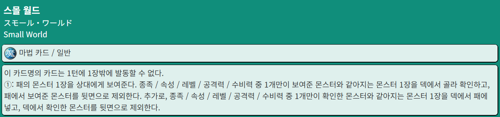
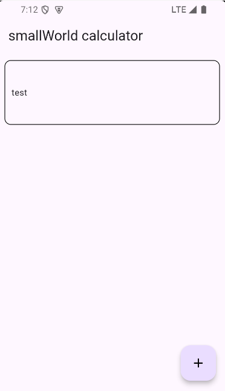
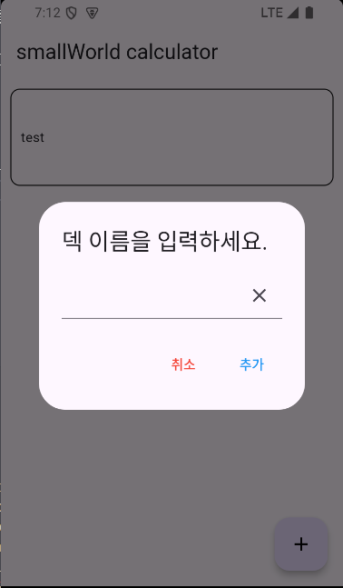
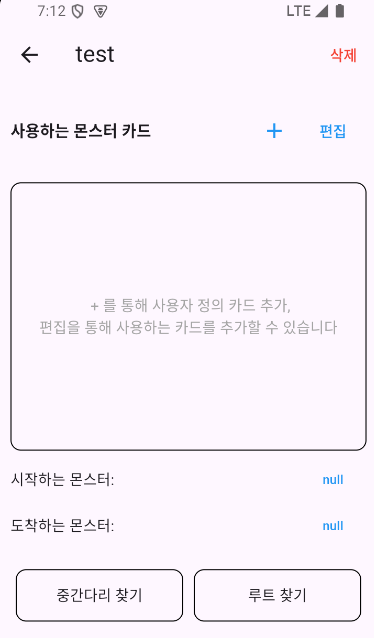
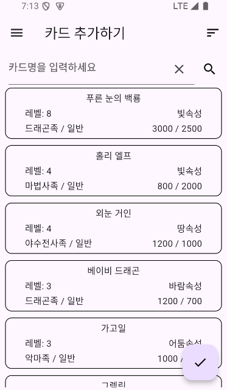
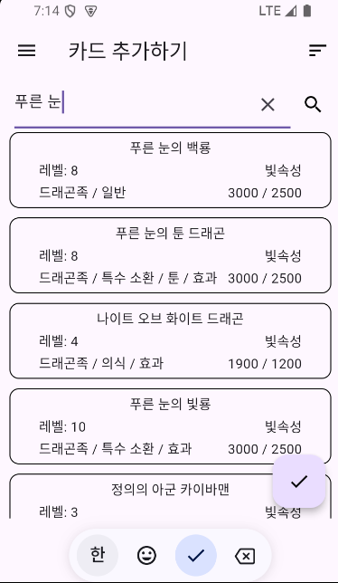
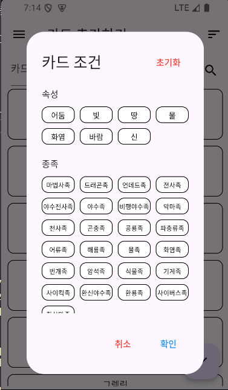
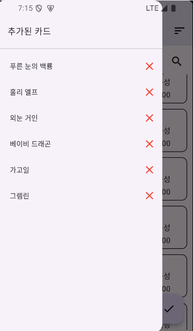
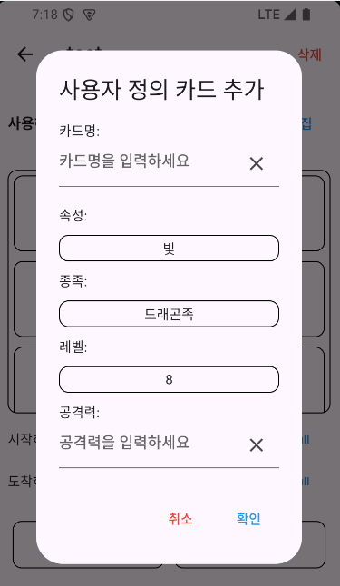

# smallWorld Deck Calculator

<br>

유희왕의 **스몰 월드**라는 카드 계산을 돕는 Flutter 모바일 앱.

<br>


## 🚀 개발 동기 (Motivation)

<br>

### 스몰 월드 카드 설명




**효과**

1. 패의 몬스터 1장을 공개하고 뒷면으로 제외하며, 그 카드와 종족/속성/레벨/공격력/수비력 중 하나만 일치하는 몬스터를 덱에서 보여준다.
2. 덱에서 보여준 몬스터를 뒷면 표시로 제외하며, 덱에서 보여준 몬스터로 1번과 똑같은 조건으로 덱에서 몬스터 1장을 골라 패에 넣는다.
3. **즉, 패 한장 + 이 카드 = 원하는 카드 확보**가 가능하다.

<br>
- 카드 게임 특성상 **원하는 카드를 가지고 올 수 있다**는 점은 강하지만, **필요하지 않은 카드 추가 및 계산이 복잡하단 단점**이 존재한다.  

<br>

-> **좋은 성능을 가졌지만, 사용하기 복잡한 카드**

<br>

### Before (문제점)
*   스몰 월드의 복잡한 조건 계산식 덕분에, 어떤 카드를 구성해야 최대로 효율을 낼 수 있는지 파악하기 어려움.
*   매번 복잡하게 보유 카드의 상황을 고려하여 계산하여야 함.

### After (개선점)
*   실제 카드 데이터 기반으로 보유 덱 리스트 구성 및 수정 가능.
*   조건에 맞는 카드의 검색 용이.
*   매번 복잡하게 계산하지 않고 보유 카드의 경로를 읽고 수행만 하면 됨.

## 데모 (Demo)

*   **[시작 화면]**
*   
    

*   **[덱 추가]**
*   
    

*   **[메인 화면]**
*   
    

*   **[데이터베이스로부터 카드 확인]**
*   
    

*   **[카드 검색 기능]**
*   
    

*   **[카드 검색 필터]**
*   
    

*   **[카드 정보 확인]**
*   
    

*   **[현재 선택한 카드 관리]**
*   
    

*   **[스몰 월드 루트 계산]**
*   
    

*   **[사용자 정의 카드 추가]**
*   
    


## ✨ 주요 기능 (Features)

*   **덱 관리**: 새 덱 생성, 이름 지정, 목록 관리.
*   **카드 편집**: 각 덱 카드 추가 또는 제거.
*   **로컬 데이터 저장**: `sqflite` DB 통해 모든 덱 정보 기기에 안전 저장.
*   **화면 구성**: 스플래시, 메인, 상세, 편집 화면으로 직관적 구성.
*   **실제 카드 데이터**: 앱 개발 당시 최신 카드의 정보까지 모두 수록
*   **사용자 정의 카드 추가**: 카드 데이터 갱신이 되지 않아도, 사용자가 필요한 카드 정보를 임의로 리스트에 추가하여 계산에 사용 가능.

## 📐 아키텍처 (Architecture)

1.  **UI (Screens)**: `SplashScreen`, `MainScreen`, `DetailScreen`, `EditScreen`, `RouteScreen`으로 구성.
    *   `MainScreen`: 저장된 덱 목록 표시, 새 덱 생성 시작점.
    *   `DetailScreen`: 특정 덱 상세 정보 및 계산 통계 표시.
    *   `EditScreen`: 덱 포함 카드 수정 인터페이스 제공.
2.  **Data Layer (Helper)**: `DeckDatabaseHelper`, `CardDatabaseHelper`가 DB CRUD 작업 담당. `sqflite` 플러그인 활용, SQLite DB와 상호작용.
3.  **Data Models**: `DeckData`, `CardDataInfo` 클래스, 덱 및 카드 데이터 구조 정의.

## 🛠️ 기술 스택 (Tech Stack)

*   **Framework**: `Flutter`
*   **Language**: `Dart`
*   **Database**: `sqflite` (로컬 SQLite 데이터베이스)
*   **State Management**: `StatefulWidget` 및 `setState` 활용 기본 상태 관리

## 🏁 시작하기 (Getting Started)

### 요구 사항

*   Flutter SDK (3.x.x 이상 권장)
*   Dart SDK

### 설치 및 실행

1.  저장소 클론:
    ```bash
    git clone [Your Repository URL]
    ```
2.  프로젝트 디렉토리 이동:
    ```bash
    cd small_world
    ```
3.  패키지 설치:
    ```bash
    flutter pub get
    ```
4.  앱 실행 (에뮬레이터 또는 연결 디바이스):
    ```bash
    flutter run
    ```

## 🤔 기술적 문제 해결 사례 (Troubleshooting)

### 1. '스몰 월드' 경로 탐색 알고리즘 구현

*   **문제**: '스몰 월드' 카드의 효과는 **"종족, 속성, 레벨, 공격력, 수비력 중 정확히 하나만 같은"** 몬스터를 찾는 복잡한 조건을 가짐. 사용자가 선택한 덱 내에서 시작, 중간, 끝 카드 세 장으로 이어지는 유효한 경로를 효율적으로 탐색해야 하는 과제가 있었음.
*   **해결**:
    *   각 카드의 비교 대상이 될 5가지 속성(공격력, 수비력, 종족, 레벨, 속성)을 `List<dynamic>` 형태로 변환.
    *   두 카드의 속성 리스트를 각각 `Set`으로 만들고, `Set.intersection()`을 사용하여 교집합을 구함.
    *   교집합의 `length`가 정확히 `1`인지 확인하여, '스몰 월드'의 복잡한 조건을 간결하고 효율적으로 검사하는 로직을 구현. 이 방식을 통해 시작-중간, 중간-끝 카드의 유효성을 빠르게 판단.
*   **결과**: Dart의 집합(Set) 자료구조를 효과적으로 활용하여, 다중 조건을 가진 복잡한 탐색 문제를 O(N^2) 복잡도 내에서 해결. 앱의 핵심 기능인 경로 계산을 빠르고 정확하게 수행하는 기반을 마련.

### 2. 앱 최초 실행 시 데이터베이스 에셋(Asset) 초기화

*   **문제**: 앱 기능에 필수적인 수천 개의 카드 정보가 담긴 `card_archive.db` 파일을 앱에 내장해야 함. `sqflite`는 앱 내부 저장소의 파일만 접근 가능하므로, 앱 설치 후 최초 실행 시 `assets` 폴더의 DB 파일을 앱의 쓰기 가능한 내부 저장소로 안전하게 복사하는 로직이 필요했음.
*   **해결**:
    *   `initDatabase` 함수 내에서 `getDatabasesPath()`로 앱의 DB 저장 경로를 먼저 확인.
    *   `dart:io`의 `File(path).exists()`를 통해 해당 경로에 파일이 존재하는지 검사하여, 최초 실행 여부를 판단.
    *   파일이 없을 경우에만 `rootBundle.load`로 `assets`의 DB 파일을 메모리로 불러온 후, `writeAsBytes`를 통해 내부 저장소 경로에 파일로 저장.
*   **결과**: 앱의 후속 실행 시에는 불필요한 파일 복사 작업을 건너뛰어, 사용자의 기존 데이터가 덮어쓰여지는 것을 방지하고 로딩 시간을 단축함. 대용량 에셋을 안전하고 효율적으로 초기화하는 모바일 앱의 표준적인 문제 해결 패턴을 성공적으로 적용.
